<h1 align="center">Hi, I'm Berke 👋</h1>

  Robotics & AI engineer. 
  I make robot arms see, plan and move — ROS 2, MoveIt 2, 3D perception and deep learning.

  
  
  
  
  
  
  
  

---

### 🔧 What I work on

- 🦾 **Manipulation & motion planning** — MoveIt 2, ros2_control, cobot integration
- 👁️ **3D perception** — point clouds (PCL, Open3D), edge and feature detection, eye-in-hand mapping
- 🧠 **AI for robotics** — deep-learning-based vision, learned detectors in ROS 2 pipelines
- 📐 **Calibration** — hand-eye, camera and laser-scanner extrinsics
- 🌐 **Tooling** — web-based UIs and PWAs

### 🛠️ Toolbox

<!-- TOOLBOX:START -->

<b>Robotics</b> 

<b>Hardware &amp; control</b> 

<b>Simulation</b> 

<b>Sensors &amp; actuators</b> 

<b>Perception</b> 

<b>AI / LLMs</b> 

<b>Linux &amp; shell</b> 

<b>Languages</b> 

<b>Tools</b> 

<!-- TOOLBOX:END -->

### 📌 Featured

- [**ev-listesi**](https://github.com/berkeunlu/ev-listesi) — offline-first household shopping list PWA (TypeScript, IndexedDB, installable on iOS)

### 📈 GitHub stats

  

### 📬 Reach me

  
  
  

